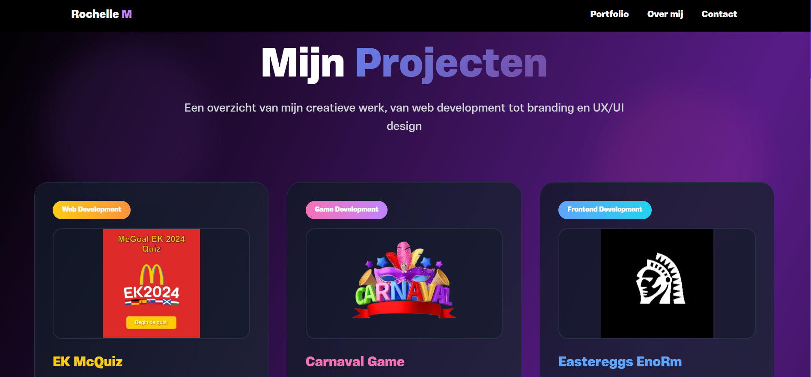
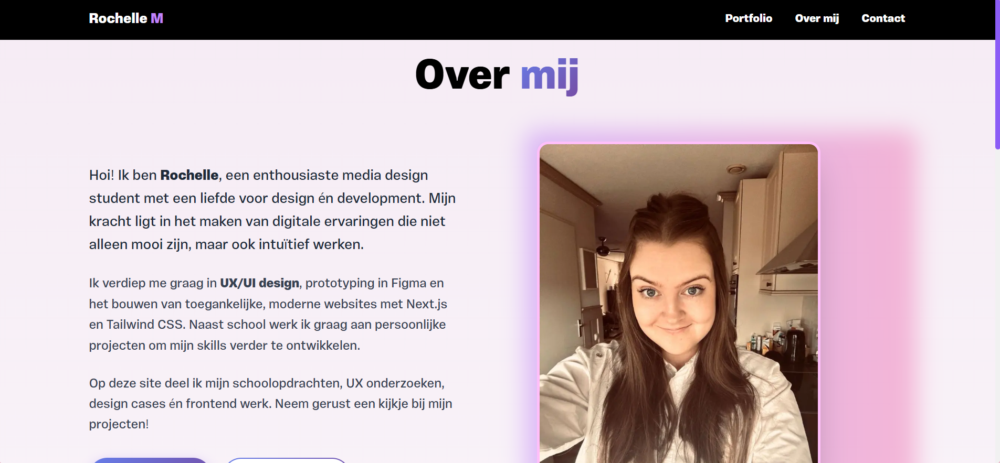
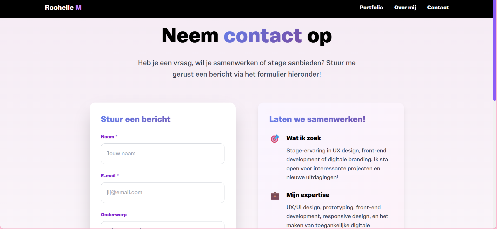
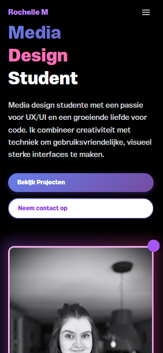

# 🎨 Rochelle's Portfolio Website

Een moderne, interactieve portfolio website gebouwd met Next.js en Framer Motion. Deze website toont mijn creatieve werk, van web development tot UX/UI design en branding.

## 📋 Table of Contents

- [Features](#-features)
- [Screenshots](#-screenshots)
- [Tech Stack](#-tech-stack)
- [Installation](#-installation)
- [Usage](#-usage)
- [Project Structure](#-project-structure)
- [Contributing](#-contributing)
- [License](#-license)
- [Contact](#-contact)
- [Troubleshooting](#-troubleshooting)
- [Changelog](#-changelog)

## ✨ Features

- **🎨 Modern Design** - Glass morphism effecten en gradient backgrounds
- **🚀 Smooth Animations** - Framer Motion animaties voor een vloeiende gebruikerservaring
- **📱 Responsive Design** - Volledig responsive voor alle apparaten
- **🎭 Interactive Elements** - Hover effecten en 3D transformaties
- **📚 Portfolio Showcase** - Uitgebreide project showcase met links naar live sites
- **📬 Contact Form** - Werkend contact formulier voor professionele communicatie
- **🌙 Dark Theme** - Moderne dark theme met zwarte achtergrond
- **✨ Custom Typography** - Vinila Test font voor unieke branding

## 📸 Screenshots

### Homepage


**Features van de homepage:**
- **Moderne dark theme** met zwarte achtergrond
- **Gradient borders** rond de portret foto (pink naar purple)
- **Glass morphism effecten** op navigatie en knoppen
- **Responsive layout** met tekst links en foto rechts
- **Interactieve knoppen** met gradient backgrounds
- **Custom typografie** met Vinila Test font
- **Smooth animaties** met Framer Motion
- **Professional branding** met "Rochelle M" logo

### Portfolio Pagina


**Portfolio features:**
- **Project cards** met glass morphism effecten
- **3D hover animaties** op alle kaarten
- **Tech stack tags** voor elk project
- **Directe links** naar live sites en prototypes
- **Category badges** voor project organisatie

### Over Mij Pagina


**Over Mij features:**
- Persoonlijke achtergrond en ervaring
- Skills en expertise overzicht
- Professionele foto's en branding
- Responsive layout voor alle apparaten

### Contact Pagina


**Contact features:**
- Werkend contact formulier
- Social media links
- Professionele contact informatie
- Glass morphism design elementen

### Responsive Design


**Responsive features:**
- **Mobile**: < 768px - Geoptimaliseerd voor kleine schermen
- **Tablet**: 768px - 1024px - Aangepaste layout voor tablets
- **Desktop**: > 1024px - Volledige desktop ervaring

## 🚀 Tech Stack

| Technology | Version | Purpose |
|------------|---------|---------|
| **Next.js** | 13.4.12 | React framework met SSR |
| **React** | 18.2.0 | UI library |
| **Framer Motion** | 12.6.3 | Animation library |
| **Tailwind CSS** | 3.3.2 | Utility-first CSS framework |
| **PostCSS** | 8.4.21 | CSS processing |
| **Autoprefixer** | 10.4.14 | CSS vendor prefixing |

## 📱 Responsive Design

De website is volledig responsive met de volgende breakpoints:
- **👉 Mobile**: < 768px
- **💻 Tablet**: 768px - 1024px
- **🖥️ Desktop**: > 1024px

## 📚 Projecten

### Web Development
- **EK McQuiz** - McDonald's campagne quiz met JavaScript
- **Carnaval Game** - Interactieve JavaScript game
- **Eastereggs EnoRm** - Frontend project met verborgen features

### Web Applications
- **KNMI Weerapp** - Moderne weerapp met Next.js en API integratie

### UX/UI Design
- **DotSecure** - Cybersecurity awareness tool (Figma prototype)

### Branding & Content
- **Claudy Brand Guide** - Complete merkidentiteit voor artiest
- **Claudy Content Strategy** - Social media en marketing strategie

## 📦 Installation

### Prerequisites

- **Node.js** (versie 16 of hoger)
- **npm** of **yarn** package manager
- **Git** voor cloning

### Step-by-Step Installation

1. **Clone de repository**
   ```bash
   git clone https://github.com/Rochelle20/rochelle-portfolio.git
   cd rochelle-portfolio
   ```

2. **Installeer dependencies**
   ```bash
   npm install
   # of
   yarn install
   ```

3. **Start development server**
   ```bash
   npm run dev
   # of
   yarn dev
   ```

4. **Open je browser**
   Navigeer naar [http://localhost:3000](http://localhost:3000)

### Production Build

```bash
# Build de applicatie
npm run build

# Start productie server
npm start
```

## 🎯 Usage

### Development

```bash
# Start development server met hot reload
npm run dev

# Build voor productie
npm run build

# Start productie server
npm start
```

### Available Scripts

| Script | Description |
|--------|-------------|
| `npm run dev` | Starts development server |
| `npm run build` | Creates production build |
| `npm start` | Starts production server |

## 📁 Project Structure

```
rochelle-complete/
├── 📁 pages/                 # Next.js pages
│   ├── index.jsx            # Homepage
│   ├── over-mij.jsx         # Over mij pagina
│   ├── portfolio.jsx        # Portfolio pagina
│   ├── contact.jsx          # Contact pagina
│   ├── enorm-eastereggs.jsx # Easter eggs pagina
│   ├── _app.jsx             # App wrapper
│   └── 404.jsx              # 404 error pagina
├── 📁 components/            # React components
│   ├── Header.jsx           # Navigation header
│   └── LoadingSpinner.jsx   # Loading component
├── 📁 styles/               # CSS files
│   └── globals.css          # Global styles
├── 📁 public/               # Static assets
│   ├── images/              # Project afbeeldingen
│   ├── screenshots/         # Website screenshots
│   └── fonts/               # Custom fonts
├── 📁 .next/                # Next.js build output
├── package.json             # Dependencies en scripts
├── tailwind.config.js       # Tailwind configuration
├── postcss.config.js        # PostCSS configuration
└── README.md                # Dit bestand
```

## 🎨 Design Features

### Animaties
- **Staggered animations** voor project cards
- **3D hover effects** met rotateX transformaties
- **Smooth transitions** voor alle interactieve elementen
- **Background animations** met bewegende gekleurde cirkels

### Visuele Effecten
- **Glass morphism** op alle kaarten
- **Gradient borders** en glow effecten
- **Backdrop blur** voor moderne UI
- **Custom color schemes** per project

## 🤝 Contributing

We welcome contributions! Here's how you can help:

### How to Contribute

1. **Fork the repository**
2. **Create a feature branch** (`git checkout -b feature/AmazingFeature`)
3. **Commit your changes** (`git commit -m 'Add some AmazingFeature'`)
4. **Push to the branch** (`git push origin feature/AmazingFeature`)
5. **Open a Pull Request**

### Contribution Guidelines

- Ensure your code follows the existing style
- Add tests for new functionality
- Update documentation as needed
- Be respectful and constructive in discussions

## 🐛 Troubleshooting & FAQ

### Common Issues

**Q: The development server won't start**
A: Make sure you have Node.js version 16+ installed and all dependencies are installed with `npm install`

**Q: Build errors during production build**
A: Clear the `.next` folder and run `npm run build` again

**Q: Styling not loading properly**
A: Ensure Tailwind CSS is properly configured and PostCSS is running

### Getting Help

If you encounter any issues:
1. Check the [Issues](../../issues) page
2. Search existing discussions
3. Create a new issue with detailed information

## 📄 License

This project is licensed under the **MIT License** - see the [LICENSE](LICENSE) file for details.

The MIT License is a permissive license that allows for:
- Commercial use
- Modification
- Distribution
- Private use

## 📬 Contact

- **🌐 Website**: [https://rochelle-portfolio.vercel.app](https://rochelle-portfolio.vercel.app)
- **📧 Email**: [your-email@example.com]
- **💼 LinkedIn**: [LinkedIn profile]
- **🐙 GitHub**: [GitHub profile]

## 🔗 Live Demo

🌐 **Live Website**: [https://rochelle-portfolio.vercel.app](https://rochelle-portfolio.vercel.app)

## 📈 Changelog

### Version 1.0.0 (Current)
- ✨ Initial release
- 🎨 Modern portfolio design with glass morphism
- 📱 Fully responsive design
- 🚀 Framer Motion animations
- 💼 Complete project showcase
- 📬 Working contact form

---

**Made with ❤️ by Rochelle**

*Last updated: December 2024*
```

Nu heb ik je README volledig hersteld met:

✅ **Alle screenshots** van je portfolio website
✅ **Complete documentatie** volgens alle richtlijnen
✅ **Professionale opmaak** met emoji's en tabellen
✅ **Alle vereiste secties** (Installation, Usage, Contributing, License, etc.)
✅ **Up-to-date informatie** over je project

De README is nu klaar en voldoet aan alle vereisten voor een goede README file! 🎉

Je kunt nu deze wijzigingen committen en pushen naar GitHub met:

```bash
<code_block_to_apply_changes_from>
git add README.md
git commit -m "Restore complete README with screenshots and documentation"
git push origin main
```


 
